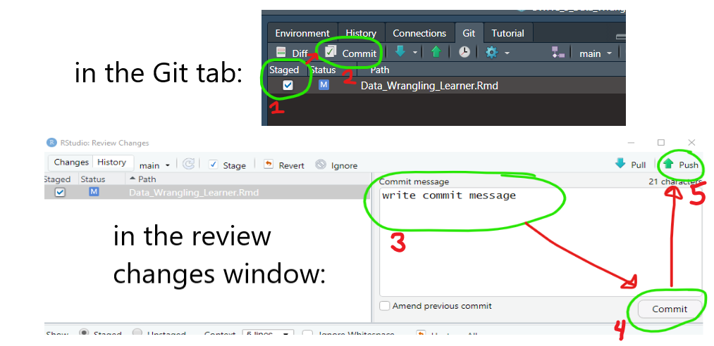
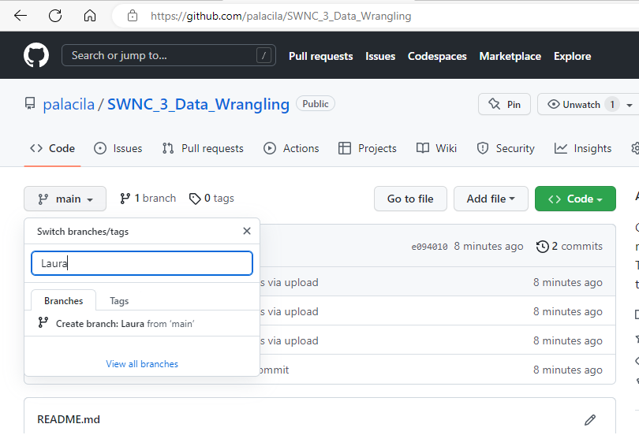
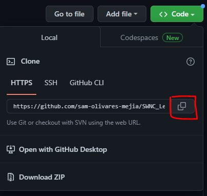
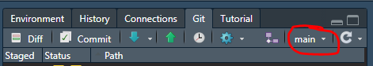
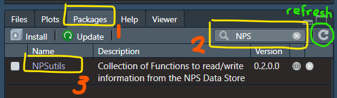

```{r setup, include=FALSE}
# Call the required libraries
library(knitr)
library(tidyverse)
library(janitor)
library(devtools)
library(NPSutils)
library(readxl)

# This is auto-populated in RMD creation and used for formatting purposes.
opts_chunk$set(echo = TRUE)
```

# R Data wrangling #2 {.tabset}
This R reaching session will be a continuation of data wrangling tasks which commonly occur in I+M activities. 

We will cover: 
0. Awards and Accolades! 
1. GitHub Reminders
2. Groundhog Data Review 
  a. Mutate() function
3. Importing data from NPS Data Store
4. Today's Question!
5. Wrangling NPS Data 
  a. Explore our data 
  b. Join data frames together
  c. Clean up data
  d. filter by year and name
  e. answer our question 
  f. put it all together! 
6. Github Reminder - Don't forget to push your progress onto Github at the end of the session!
7. Extensions 

## 0. Awards and Accolades ! 
  {width= 250, align=center} </br> 
 Congratulations to Carolyn for successfully pushing her edits from our last data wrangling session to GitHub, and to Arista, Jessica, Kate, and Rachel for successfully forking their repositories! You are all recipients of our Golden Groundhog award! 

## 1. Github Reminders 

Last session we forgot to remind you to push your edits up to GitHub. Don't worry though- we are working off the same repository this time, so that we can continue to practice the GitHub workflow! 

Some of you worked off branches of the repository, while some of you worked off forks. What is the difference? 

A branch allows you to add edits without affecting the main branch, but is still part of the original repository, allowing your commits to be pushed and accessed by collaborators within that repository. 

A fork is a clone of the entire repository, working independently from the original repository, and without the ability to push and pull commits to collaborators on the original repository. 


For more review- refer to the 'Github_Basics_Review.html' in this repository, or check out our [SWNC_2_Learning_Github Repository](https://github.com/sam-olivares-mejia/SWNC_2_Learning_Github) for even more detail! 


### For those who completed the last session in a branch: 

  1. Stage, commit, and push your edits from the last session to your branch! 
  
   {width=350px, align=center} </br>
  
  2. Then, pull the new edits we made off the main branch, and copy the Data_Wrangling2_Learner.Rmd from the main branch into your individual branch 

### For those who completed the last session in a fork, or did not complete the last session: 

  1. Send Laura your gitHub username so that she can give you editing access to the repo
  2. Go to the location of the repository at [https://github.com/palacila/SWNC_3_Data_Wrangling](https://github.com/palacila/SWNC_3_Data_Wrangling). 

  3. Click on the **main dropdown** in the upper left, and begin typing your name separated by underscores. Once complete, click on **'Create branch:*your name* from main'**. This will create your branch! 

  {width=350px, align=center} </br>
  
  4. Clone the Repo
Click on **code** in the upper right, and copy the HTTPS url provided. 

  {width=250px, align=center} </br>

  5. Open R Studio. Go to **File>NewProject>VersionControl>Git** . Paste the repository URL. Information and download location should auto-populate. Click **Create Project**.

  6. Switch to your branch in R studio. 

  {width=500px} </br>

## 2. Groundhog Data Review

Last session, we worked on cleaning up our groundhog data to find out how many times Punxatawney Phil correctly predicted an early spring in Pennsylvania. Let's review some of the skills we learned by importing our data again using the read.csv() function, and cleaning it up using the tidyverse/janitor functions. 

Remember we will have to load our csv, tidyverse, and janitor packages in order to use functions outside the base library!
**To do** run the code below to load the packages we need into our library 
``` {r}
#if you have not installed these libraries yet run the following three lines of code in your console: 
# install.packages("csv")
# install.packages("tidyverse")
# install.packages("janitor")

#load libraries 
library(csv)
library(tidyverse)
library(janitor)
```

**To do** run the code below to import and clean up the Groundhog Dataset
``` {r}
# Import the dataset 
groundhog_raw <- read.csv("data/Groundhog_Data.csv")
#clean up the groundhog dataset
groundhog_clean <- groundhog_raw %>%
  # Batch rename using find and replace (gsub)
  rename_with(function(x){gsub("February.Average.Temperature..","Feb_",x)}) %>%
  rename_with(function(x){gsub("March.Average.Temperature..","Mar_",x)}) %>%
  # Janitor to clean names
  clean_names() %>%
  # Convert missing character string to NA
  mutate_if(is.character, list(~na_if(., ""))) %>%
  # remove all NAs from dataframe
  drop_na() %>%
  # Transform a column to a different data type and perform a logical test
  transform(year = ISOdate(year, 1, 1)) %>%
  filter(year >= "1900-01-01" & year < "2001-01-01")

```

Let's focus only on our Pennsylvania data again. 

**To do** Begin with *groundhog_penn<-* and use a tidyverse pipeline from groundhog_clean along with the select() function to select only the columns related to Pennsylvania, in addition to the Year and Punxsutawntey_Phil fields.
```{r}
#create new opject groundhog_penn from groundhog_clean
groundhog_penn<-groundhog_clean %>%
   #use select function
  select(year, punxsutawney_phil, feb_pennsylvania, mar_pennsylvania)
```

### Mutate() Function

Let's introduce a new function! 

The mutate() function lets us adds new variables to a data set while preserving existing ones. You can create and populate new fields by assigning the field name to a value.

The mutate function uses the following format when creating new variables: 
*data<- mutate(new_variable = value)*

Copy & Paste `?mutate()` into your console if you want to learn more about the function from the documentation files. 

**To do** Run the code below to create an empty column called 'degree_units' and populate it with 'Fahrenheit' 
```{r}
#mutate data set to add column 'degree_units'
groundhog_mutate<-groundhog_penn %>%
  mutate(degree_units='Farenheit')
```

You can also use the mutate() function to create a new variable from modifying pre-existing variables via an expression.

Let's try to figure out what years the average temperature went up more than 10 degrees Fahrenheit from February to March for Pennsylvania. This is another way we could have determined an "early spring" to answer our original question. 

**To do** Begin with *groundhog_mutate<-* and add a column to groundhog_mutate called 'temp_change' that is equal to the difference between 'mar_pennsylvania' and 'feb_pennsylvania'

```{r}
#create object groundhog_mutate from groundhog_mutate
groundhog_mutate<-groundhog_mutate %>%
  #mutate to add new column 'temp_change' which is difference 
  #between mar_pennsylvania and feb_pennsylvania
  mutate(temp_change=mar_pennsylvania-feb_pennsylvania)
```

We can add a new column telling us if the temperature increased more than 10 degrees farenheit by using the mutate() function with an ifelse() statement from base R.

The ifelse() function uses an expression to chose one of two options. If the expression is true, it executes the first option, and if the expression is false, it executes the second option.

The ifelse() function uses the following format: 
*ifelse(expression, execution if expression is true, execution if expression is false)*

**To do** run the code below to create a new column called 'early_spring' and populate it with a 'yes' if the value in the 'temp_change' field is greater than 10, and a 'no' if the value is less than 10. 
```{r}
#create object groundhog_mutate from groundhog_mutate
groundhog_mutate<-groundhog_mutate %>%
  #mutate to add new column 'early_spring' using ifelse statement
  mutate(early_spring=ifelse(temp_change>10, 'yes', 'no'))
```

Finally, let's filter the data to give us only the observations where punxsutawney_phil='No Shadow' and early_spring='yes'

**To do** begin with *groundhog_final<-* and use the filter() function fo filter data that has 'No Shadow' in the punxsutawney_phil field and 'yes' in the early_spring field. 
```{r}
#create object groundhog_final from groundhog_mutate
groundhog_final<-groundhog_mutate%>%
  #filter to keep data with 'No Shadow' in punxsutawney_phil field 
  #and 'yes' in early_spring field.
  filter(punxsutawney_phil=='No Shadow' & early_spring=='yes')
# hint: you should end up with 4 observations 
```

As you can see there's many ways to manipulate data frames using the mutate() function! We were able to create new fields and populate them manually, with an expression, and with a condition. 

Now let's apply these principles and learn about new functions using I&M data! 


## 3. Importing Data from NPS DataStore

So far, we've been working with data found in our project directory. Today we're going to practice pulling data from NPS DataStore using the [NPSutils package](https://nationalparkservice.github.io/NPSutils/)

This is a package that was developed by the I&M support office ans specifically designed to acquire data from NPS DataStore, and requires the devtools package in order to install it from GitHub since its still under development. 

**To do** copy and paste the code below (without the #) into your console to install the devtools package, and then load it into your library. 
```{r}
# install.packages("devtools")
library(devtools)
```

**To do** once devtools is loaded into your library, copy and paste the code below (without the #) into your console to install NPSutils
```{r}
# devtools::install_github("nationalparkservice/NPSutils")
```

*You may get a prompt asking you if you'd like to update packages; enter 1 and hit enter to update all packages*


______________________________________________________________________


**Time for a break! While we wait for everyone's packages to finish installing, take 10 mins to stretch, get a snack, and reset for the next section.**

If you'd like, feel free to look through the NPSutils package using the packages tab in Rstudio (you may need to refresh the window before doing so), and brainstorm which functions you think we'll be using from the NPsutils package!


{width=500px} </br>


______________________________________________________________________


Welcome back! 

We are going to be working with some uplands data from Bighorn Canyon National Recreation Area developed by the Mojave Desert Network. The original data can be found on [NPSDataStore](https://irma.nps.gov/DataStore/Reference/Profile/2215186) and is a public data set. We will need to know the reference ID, which in this case is '2215186'.


There are two functions of interest in the NPsutils package that we could use to import our data.First, let's load the NPSutils package into our library.

**To do** run the code below to load the NPSutils package
```{r}
library(NPSutils)
```

We are going to be using the get_data_package() function. Which retrieves digital data package holdings from DataStore. 

When reading the description of the documentation file, we learn that get_data_package creates a directory called "data" in the current working directory (unless it already exists). For each data package it writes a new sub-directory of 'data' named with the corresponding data package reference Id, and populates it with the files in the data package. 

The Arguments section tells us that the function takes in a 'reference_id' (in this case '2215186' and a 'secure' which defaults to FALSE for public data. 

**To do** Write code in the code chunk below to import the uplands data into your directory. 
```{r}
#import data into your directory 
get_data_package(2215186) 
```
**To do** In the files tab, navigate through your file directory, and confirm that your data loaded correctly into the 'data' folder. 

*hint: data should be located in a file named 'NPS_BICA_UplandVegMonitoringData_and_Documentation_2011through2021.xlsx*

Notice that the file we loaded is an .xlsx file. The groundhog data we used previously was a csv file that we read into r using the read.csv() function from the csv package. Luckily there are packages/functions dedicated to reading in .xlsx files. We will be using the readxl package.

**To do** Run the code below to install and load the readxl package into your library 
```{r}
# install.packages("readxl")
library(readxl)
```

We will be using the read_xlsx() function to read in our data. We will have to specify the path, as well as the sheet we want to read in. We are going to create two data frame objects from the 'BICA Data 2011 through 2021' and 'Target Species List' sheets. 

**To do** Finish and run the code below to create an object for each sheet of our data. 
```{r}
#read in uplands data
BICA_uplands<- read_xlsx(path='data/2215186/NPS_BICA_UplandVegMonitoringData_and_Documentation_2011through2021.xlsx', sheet='BICA Data 2011 through 2021')
#read in target species data 
target_species<- read_xlsx(path='data/2215186/NPS_BICA_UplandVegMonitoringData_and_Documentation_2011through2021.xlsx', sheet='Target Species List')
```

**To do** View the data frames you just created by clicking on their names in the data section of the environment tab (upper right window). 

You may notice that BICA_uplands should have 48688 observations of 14 variables, and target_species has 69 observations of 14 variables. 

## 4. Today's Question!

**How many plots contained prickly pear in 2018?** 

To answer, let's break down the question into smaller steps. 

a. Explore our data 
b. Join data frames together 
c. Clean up data
d. Get rid of duplicate rows 
e. Filter by year and species name
f. Answer our question 
g. Put it all together! 

## 5. Wrangling NPS Data

### a. Explore our data 

**To do** Use the functions from last session to explore the data
```{r}

#generate variable names
colnames(BICA_uplands)
colnames(target_species)

#summary
summary(BICA_uplands)
summary(target_species)

#generate first 6 rows of the data set 

head(BICA_uplands)
head(target_species)

#find unique species and plot values in BICA_uplands
unique(BICA_uplands$Species)
unique(BICA_uplands$PlotNumber)

#hint: we used colnames(), summary(), head(), and unique() to learn more about 
#our groundhog data

```

It looks like in order to solve our question (How many plots contained prickly pear in 2018?) we are going to need to combine our two data sets together to get the common names for our species into the BICA_uplands data frame. 


### b. Join data frames together 

Merging data sets together requires a common column between the two, otherwise known as a 'key' which serves as the link between the two data sets. 

We will be using mutate-join functions in order to accomplish this task. 

There are 4 types of joins that you can use; inner, outer(full), left, and right joins. 

The diagram below shows the relationships between the four. 

{width=500px} </br>

  - inner_join: only keeps rows with matching keys in both x AND y 
  - left_join: keeps all rows in x, adding matching columns from y 
  - right_join: keeps all rows in y, adding matching columns from x
  - full_join: includes all rows in x OR y
  
In addition to specifying what data sets to join, the join functions also require the name of the column to use as the key. Assign this argument using *by=c(x column name = y column name)*.

For example, if we wanted to join BICA_uplands with targeted_species, keeping only rows with species names found in the targeted_species data set, we can use right_join()

**To do** create new object BICA_target by joining BICA_uplands with targeted_species, keeping only rows that have targeted_species in the 'species' field
```{r}
#create new variable BICA_target by using right join with BICA_uplands 
#as x (by.x='Species'), targeted_species as y (by.y='Scientific_Name')
BICA_target<-BICA_uplands %>% 
  right_join(target_species, by=c('Species'= 'Scientific_Name'))

```

If we take a look at BICA_target, we see that the number of observations dropped from 48,688 to 37,149. This is because the entries with species not found on in the target species list are dropped. 

### c. Clean up data

Let's clean up this data so it's a bit easier to look at.

**To do** Run the code below to use select() to keep only 'SampleYear', 'PlotNumber', 'Species', and 'Common_Name' in our BICA_target data set
```{r}
#cleans up the dataframe by only keeping 4 columns 
BICA_target<- BICA_target %>%
  select(c('SampleYear', 'PlotNumber', 'Species', 'Common_Name'))
```

Now we have a data set with the species sample year, plot number, and species information from the uplands data set, linked with the common name for each species from the target species data set!! 

### d. Get rid of duplicate rows 

If you look at BICA_target, you may notice that there seems to be duplicate rows. this is because the values varied in the other variables, so when we got rid of them the data we're interested in is duplicated.You can see this more clearly if you take a look at the sample date and species columns in BICA_uplands. It looks like there were two sample dates for each plot in the same year. 

To get rid of these duplicate rows in our new data, we are going to use the distinct() function. Looking at the help file (enter ?distinct() in the console), we see that this function selects only unique/distinct rows from the data frame. 

**To do** Use the distinct() function to get rid of duplicate rows in BICA_target
```{r}
#get rid of duplicate rows using distinct()
BICA_target<- BICA_target %>%
  distinct()
```

### e. Filter by year and name
**To do** Create BICA_answer by using the filter() function on BICA_target to only keep Prickly Pear data from 2018
```{r}
#filter BICA_target by SampleYear and Common_Name
BICA_answer<- BICA_target %>% 
  filter(SampleYear==2018 & Common_Name=='Prickly pear')
```

### f. Answer our question 

**To do** Run the code below to generate a print statement with the answer to our question: *How many plots contained prickly pear in 2018?* 
```{r}
#print() is used to print a string of characters 
#paste() is used to create a string from a combination of strings and objects
#nrow() is used to give us the number of rows in a dataset 
print(paste(nrow(BICA_answer), "plots contained Prickly Pear in 2018"))
```
### g. Put it all together

Remember that the pipeline ( %>% ) is used to perform multiple functions on an option consecutively, streamlining our code. This session broke down each of the steps so we could learn about new functions, however in a typical workflow we would want to use the pipeline to use as few lines as possible (coders are lazy!)

**to do** Run the code below to combine all our work using the pipeline! 
```{r}
BICA_final<-BICA_uplands %>% 
  #join data frames together 
  right_join(target_species, by=c('Species'= 'Scientific_Name')) %>% 
  #clean up data 
  select(c('SampleYear', 'PlotNumber', 'Species', 'Common_Name')) %>% 
  #get rid of duplicate rows 
  distinct() %>% 
  #filter by SampleYear and Common_Name
  filter(SampleYear==2018 & Common_Name=='Prickly pear')
  
print(paste(nrow(BICA_final), "plots contained Prickly Pear in 2018"))
```

## 6. Github reminder!

*Congrats!!!* You made it to the end of today's session on data wrangling :) 

{width=300px} </br>
Remember to save your work and *Stage -> Commit -> Push* your work to GitHub before signing off today!  


## 7. Extensions 

Interested in learning more? Below are some ways we can adapt/extend our code. A great way to expand your skills is by reading code and trying to understand what each line accomplishes.  

Take a look at the code below and insert comments describing what each line of code does. 

Some reminders before you begin : 
  - Look up functions using ?function() to look up a function in the help tab 
  - Google and Stack Overflow 
  - Coding is better with friends is a great way practice your coding skills- look out for future R WorkSession invites :)
  - Take brain breaks - if you're stuck take a short walk, grab a snack, or just stand up and stretch for a minute. Taking time to step away from a problem is often super helpful when stuck on a problem.


### a. Using add_count()

```{r}
BICA_count <- BICA_target %>%
  add_count(SampleYear, Common_Name, name="nPlots")
```


```{r}
BICA_count <- BICA_count %>%
  filter(Common_Name=='Prickly pear') %>% 
  select(c("SampleYear", "Common_Name","nPlots")) %>% 
  distinct()
```

### b. Looking ahead: visualization 

```{r}
#requires installation of ggplot 
#install.packages("ggplot2")
library(ggplot2)
ggplot(BICA_count, aes(x=SampleYear, y=nPlots)) + 
  geom_point()
```

### c. Looking ahead: iteration

```{r}
allyears<- BICA_count$SampleYear
prickly.years<-lapply(allyears, function(year){
  filter(BICA_target,SampleYear==year & Common_Name=='Prickly pear')
}
)
names(prickly.years)<-allyears

```


