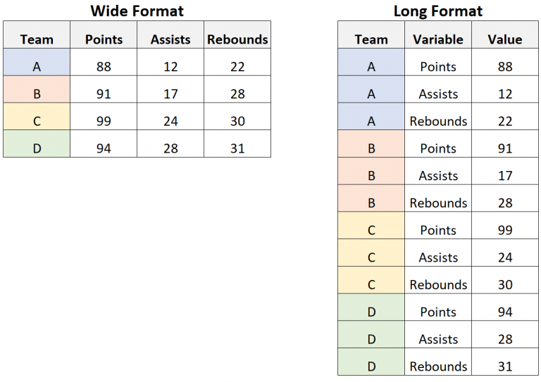

```{r setup, include=FALSE}
# Call the required libraries
library(knitr)
library(tidyverse)
library(janitor)
library(devtools)
library(NPSutils)
library(readxl)

# This is auto-populated in RMD creation and used for formatting purposes.
opts_chunk$set(echo = TRUE)
```

# R Data wrangling #2 {.tabset}
This R reaching session will be a continuation of data wrangling tasks which commonly occur in I+M activities. 

We will cover: 
0. Awards and Accolades! 
1. GitHub Reminders - Don't forget to push your progress onto Github at the end of the session!
2. Groundhog Data Review 
  a. Mutate() function
3. Importing data from NPS Data Store
4. Today's Question!
5. Wrangling NPS Data 
  a. Explore our data 
  *side note on data formats
  b. Get rid of unneeded variables 
  c. Join data frames together 
  d. Group by year/species
  e. Count # of plots 
6. Extension 

## 0. Awards and Accolades ! 
  {width= 250, align=center} </br> 
 Congratulations to Carolyn for successfully pushing her edits from our last data wrangling session to GitHub, and to Arista, Jessica, Kate, and Rachel for successfully forking their repositories! You are all recipients of our Golden Groundhog award! 

## 1. Github Reminders 

Last session we forgot to remind you to push your edits up to GitHub. Don't worry though- we are working off the same repository this time, so that we can continue to practice the GitHub workflow! 

Some of you worked off branches of the repository, while some of you worked off forks. What is the difference? 

A branch allows you to add edits without affecting the main branch, but is still part of the original repository, allowing your commits to be pushed and accessed by collaborators within that repository. 

A fork is a clone of the entire repository, working independently from the original repository, and without the ability to push and pull commits to collaborators on the original repository. 


For more review- refer to the 'Github_Basics_Review.html' in this repository, or check out our [SWNC_2_Learning_Github Repository](https://github.com/sam-olivares-mejia/SWNC_2_Learning_Github) for even more detail! 


### For those who completed the last session in a branch: 

  1. Stage, commit, and push your edits from the last session to your branch! 
  
   {width=350px, align=center} </br>
  
  2. Then, pull the new edits we made off the main branch, and copy the Data_Wrangling2_Learner.Rmd from the main branch into your individual branch 

### For those who completed the last session in a fork, or did not complete the last session: 

  1. Send Laura your gitHub username so that she can give you editing access to the repo
  2. Go to the location of the repository at [https://github.com/palacila/SWNC_3_Data_Wrangling](https://github.com/palacila/SWNC_3_Data_Wrangling). 

  3. Click on the **main dropdown** in the upper left, and begin typing your name separated by underscores. Once complete, click on **'Create branch:*your name* from main'**. This will create your branch! 

  {width=350px, align=center} </br>
  
  4. Clone the Repo
Click on **code** in the upper right, and copy the HTTPS url provided. 

  {width=250px, align=center} </br>

  5. Open R Studio. Go to **File>NewProject>VersionControl>Git** . Paste the repository URL. Information and download location should auto-populate. Click **Create Project**.

  6. Switch to your branch in R studio. 

  {width=500px} </br>

## 2. Groundhog Data Review

Last session, we worked on cleaning up our groundhog data to find out how many times Punxatawney Phil correctly predicted an early spring in Pennsylvania. Let's review some of the skills we learned by importing our data again using the read.csv() function, and cleaning it up using the tidyverse/janitor functions. 

Remember we will have to load our csv, tidyverse, and janitor packages in order to use functions outside the base library!
**To do** run the code below to load the packages we need into our library 
``` {r}
#if you have not installed these libraries yet run the following three lines of code in your console: 
# install.packages("csv")
# install.packages("tidyverse")
# install.packages("janitor")

#load libraries 
library(csv)
library(tidyverse)
library(janitor)
```

**To do** run the code below to import and clean up the Grounhog Dataset, and write in comments to tell us what each part of the code does
``` {r}
# Import the dataset 
groundhog_raw <- read.csv("data/Groundhog_Data.csv")
#clean up the groundhog dataset
groundhog_clean <- groundhog_raw %>%
  # Batch rename using find and replace (gsub)
  rename_with(function(x){gsub("February.Average.Temperature..","Feb_",x)}) %>%
  rename_with(function(x){gsub("March.Average.Temperature..","Mar_",x)}) %>%
  # Janitor to clean names
  clean_names() %>%
  # Convert missing character string to NA
  na_if("") %>%
  # remove all NAs from dataframe
  drop_na() %>%
  # Transform a column to a different data type and perform a logical test
  transform(year = ISOdate(year, 1, 1)) %>%
  filter(year >= "1900-01-01" & year < "2001-01-01")

```

**To do** Take a look at the files in our environment (top right corner). Groundhog_raw should have 132 observations, while groundhog clean should only have 101. Click the blue arrow to the left of the title to view a preview of the data and double check the column names have been cleaned up 

Let's focus only on our Pennsylvania data again. 

**To do** Begin with *groundhog_penn<-* and use a tidyverse pipeline from groundhog_clean along with the select() function to select only the columns related to Pennsylvania, in addition to the Year and Punxsutawntey_Phil fields.
```{r}
groundhog_penn<-groundhog_clean %>%
  select(year, punxsutawney_phil, feb_pennsylvania, mar_pennsylvania)
```

### Mutate() Function

Let's introduce a new function! 

The mutate() function lets us adds new variables to a data set while preserving existing ones. You can create and populate new fields by assigning the field name to a value.

The mutate function uses the following format when creating new variables: 
*data<- mutate(new_variable = value)*

Copy & Paste `?mutate()` into your console if you want to learn more about the function from the documentation files. 

**To do** Run the code below to create an empty column called 'degree_units' and populate it with 'Fahrenheit' 
```{r}
groundhog_mutate<-groundhog_penn %>%
  mutate(degree_units='Farenheit')
```

You can also use the mutate() function to create a new variable from modifying pre-existing variables via an expression.

Let's try to figure out what years the average temperature went up more than 10 degrees Fahrenheit from February to March for Pennsylvania. This is another way we could have determined an "early spring" to answer our original question. 

**To do** Begin with *groundhog_mutate<-* and add a column to groundhog_mutate called 'temp_change' that is equal to the difference between 'mar_pennsylvania' and 'feb_pennsylvania'

```{r}
groundhog_mutate<-groundhog_mutate %>%
  mutate(temp_change=mar_pennsylvania-feb_pennsylvania)
```

We can add a new column telling us if the temperature increased more than 10 degrees farenheit by using the mutate() function with an ifelse() statement from base R.

The ifelse() function uses an expression to chose one of two options. If the expression is true, it executes the first option, and if the expression is false, it executes the second option.

The ifelse() function uses the following format: 
*ifelse(expression, execution if expression is true, execution if expression is false)*

**To do** run the code below to create a new column called 'early_spring' and populate it with a 'yes' if the value in the 'temp_change' field is greater than 10, and a 'no' if the value is less than 10. 
```{r}
groundhog_mutate<-groundhog_mutate %>%
  mutate(early_spring=ifelse(temp_change>10, 'yes', 'no'))
```

Finally, let's filter the data to give us only the observations where punxsutawney_phil='No Shadow' and early_spring='yes'

**To do** begin with *groundhog_final<-* and use the filter() function fo filter data that has 'No Shadow' in the punxsutawney_phil field and 'yes' in the early_spring field. 
```{r}
groundhog_final<-groundhog_mutate%>%
  filter(punxsutawney_phil=='No Shadow' & early_spring=='yes')
# hint: you should end up with 4 observations 
```

As you can see there's many ways to manipulate data frames using the mutate() function! We were able to create new fields and populate them manually, with an expression, and with a condition. 

Now let's apply these principles and learn about new functions using I&M data! 


## 3. Importing Data from NPS DataStore

So far, we've been working with data found in our project directory. Today we're going to practice pulling data from NPS DataStore using the [NPSutils package](https://nationalparkservice.github.io/NPSutils/)

This is a package that was developed by the I&M support office ans specifically designed to acquire data from NPS DataStore, and requires the devtools package in order to install it from GitHub since its still under development. 

**To do** copy and paste the code below (without the #) into your console to install the devtools package, and then load it into your library. 
```{r}
# install.packages("devtools")
library(devtools)
```

**To do** once devtools is loaded into your library, copy and paste the code below (without the #) into your console to install NPSutils
```{r}
# devtools::install_github("nationalparkservice/NPSutils")
```

*You may get a prompt asking you if you'd like to update packages; enter 1 and hit enter to update all packages*


______________________________________________________________________


**Time for a break! While we wait for everyone's packages to finish installing, take 10 mins to stretch, get a snack, and reset for the next section.**

If you'd like, feel free to look through the NPSutils package using the packages tab in Rstudio (you may need to refresh the window before doing so), and brainstorm which functions you think we'll be using from the NPsutils package!


{width=500px} </br>


______________________________________________________________________


Welcome back! 

We are going to be working with some uplands data from Bighorn Canyon National Recreation Area developed by the Mojave Desert Network. The original data can be found on [NPSDataStore](https://irma.nps.gov/DataStore/Reference/Profile/2215186) and is a public data set. We will need to know the reference ID, which in this case is '2215186'.


There are two functions of interest in the NPsutils package that we could use to import our data.First, let's load the NPSutils package into our library.

**To do** run the code below to load the NPSutils package
```{r}
library(NPSutils)
```

We are going to be using the get_data_package() function. Which retrieves digital data package holdings from DataStore. 

When reading the description of the documentation file, we learn that get_data_package creates a directory called "data" in the current working directory (unless it already exists). For each data package it writes a new sub-directory of 'data' named with the corresponding data package reference Id, and populates it with the files in the data package. 

The Arguments section tells us that the function takes in a 'reference_id' (in this case '2215186' and a 'secure' which defaults to FALSE for public data. 

**To do** Write code in the code chunk below to import the uplands data into your directory. 
```{r}
get_data_package(2215186) 
```
**To do** In the files tab, navigate through your file directory, and confirm that your data loaded correctly into the 'data' folder. 

*hint: data should be located in a file named 'NPS_BICA_UplandVegMonitoringData_and_Documentation_2011through2021.xlsx*

Notice that the file we loaded is an .xlsx file. The groundhog data we used previously was a csv file that we read into r using the read.csv() function from the csv package. Luckily there are packages/functions dedicated to reading in .xlsx files. We will be using the readxl package.

**To do** Run the code below to install and load the readxl package into your library 
```{r}
# install.packages("readxl")
library(readxl)
```

We will be using the read_xlsx() function to read in our data. We will have to specify the path, as well as the sheet we want to read in. We are going to create two data frame objects from the 'BICA Data 2011 through 2021' and 'Target Species List' sheets. 

**To do** Finish and run the code below to create an object for each sheet of our data. 
```{r}
#read in uplands data
BICA_uplands<- read_xlsx(path='data/2215186/NPS_BICA_UplandVegMonitoringData_and_Documentation_2011through2021.xlsx', sheet='BICA Data 2011 through 2021')
#read in target species data 
target_species<- read_xlsx(path='data/2215186/NPS_BICA_UplandVegMonitoringData_and_Documentation_2011through2021.xlsx', sheet='Target Species List')
```

**To do** View the data frames you just created by clicking on their names in the data section of the environment tab (upper right window). 

You may notice that BICA_uplands should have 48688 observations of 14 variables, and target_species has 69 observations of 14 variables. 

## 4. Today's Question!

**How many plots contained prickly pear in 2018?**

To answer, let's break down the question into smaller steps. 

a. Explore our data 
b. Get rid of unneeded variables 
c. Join data frames together 
d. Group by year/species
e. Count # of plots 

## 5. Wrangling NPS Data

### a. Explore our data 

**To do** Use the functions from last session to explore the data
```{r}

#generate variable names
colnames(BICA_uplands)
colnames(target_species)

#summary
summary(BICA_uplands)
summary(target_species)

#generate first 6 rows of the data set 

head(BICA_uplands)
head(target_species)

#find unique species and plot values in BICA_uplands
unique(BICA_uplands$Species)
unique(BICA_uplands$PlotNumber)

#hint: we used colnames(), summary(), head(), and unique() to learn more about our groundhog data

```
### A quick side note on data set structure

Our target_species data set is in what we call 'wide' format. This means that values *do not* repeat in the first column. On the other hand, out BICA_uplands data set is in a 'long' format, meaning it contains values that *do* repeat in the first column. 

{width=500px} </br>


Each format serves different purposes. Typically, data should always be long during processing, as it makes the data easy to store, and allows easy transformations to other types. Wide data can be useful when visualizing the data or making quick comparisons. 

To switch between the two format types, we can use the pivot_longer() and pivot_wider() functions. 

Take the first 6 rows of the target_species data frame. We can turn this into long format by using pivot_longer(), which requires the data, column names to pivot into longer format as variables, and new column name. 

**To do** run the code below to turn target_species into long format. 
```{r}
#pivot the target_species df into long format using the Targeted_year columns
longer_target_species <- target_species %>%
  head() %>% 
  pivot_longer(c(Targeted_2011,Targeted_2012, Targeted_2013, Targeted_2014, Targeted_2015, Targeted_2016, Targeted_2017, Targeted_2018, Targeted_2019, Targeted_2020, Targeted_2021 ), "year")
```

To turn the data back into wide format, use pivot_wider() by assigning names_from as the column to get the name of the ouput column, and which column to get the cell values from. 

```{r}
#pivot the longer_target_species df back to wider format by assigning the column to get the names of the new fields from, and column to get the values from. 
wider_target_species<- longer_target_species %>%
  pivot_wider(names_from=year, values_from=value)
```


### b. Get rid of unneeded variables 
```{r}

```

### c. Join data frames together 

```{r}


```

### d. Group by year/species

### e. Count number of plots 

## 6. Extension 

