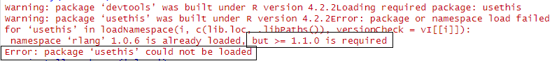
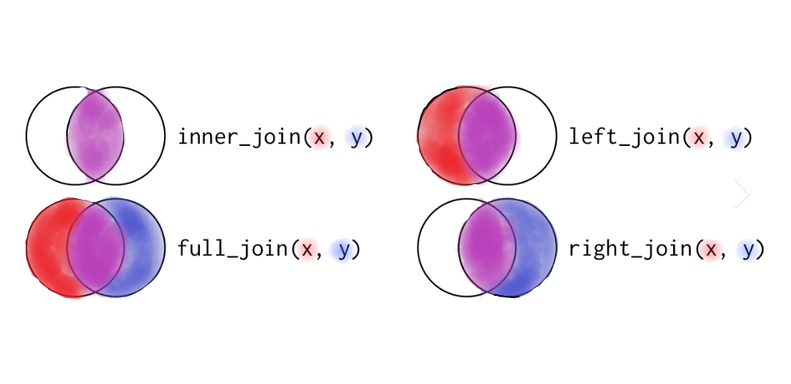

# R Data wrangling #3 {.tabset}
This R reaching session will be a continuation of data wrangling tasks which commonly occur in I+M activities. 

We will cover: 
0. Awards and Accolades!
1. Github Repo Pull
2. Libraries
  a. CRAN
  b. Github
3. Importing data from NPS data store
4. The Question
5. Data Wrangling - CRMO data
6. Data Wrangling - JOMU data
7. Merging data


## 0. Awards and Accolades! 
{} </br> 
  
 Congratulations to Arista and Rachel for successfully pushing their edits from our last data wrangling session to GitHub! You are both recipients of our Golden Prickly Pear Award! 

Please let me know if I missed anyone else for this high honor!
 
### Survey Results
The survey results are in! Thank you to everyone who completed the survey, we appreciate your feedback and have integrated as much as we can into our workplan.  We received one question that we wanted to address.
{} </br> 
 Yes! These are the results that we see. Our anonymous surveys will always be truly anonymous!


## 1. GitHub

### More Information
We are going to be continuing work in [!https://github.com/LauraFalk/SWNC_3_Data_Wrangling](https://github.com/LauraFalk/SWNC_3_Data_Wrangling), a continuation of previous trainings. For more detailed GitHub instructions (with pictures) you can reference our previous training: Data Wrangling 1 and Data Wrangling 2 in the same repository. For more into Github, see Sam's training: [!https://github.com/sam-olivares-mejia/SWNC_Learning_Github](https://github.com/sam-olivares-mejia/SWNC_Learning_Github)

### Note about trainings
Training steps are sequential within our trainings. Ensure that all steps are completed before moving on to the next step to ensure error-less success!


### Let's get the repo on our computers!

We will have four different adventure choices for this training, depending on which other trainings you have come to.

*1. I do not have a Github account* You can still follow along with the training. Rather than branching (making an editable copy of the training that you can send back) you will clone (work on your local machine). We'll go over how to do this. Complete ONLY step 3 to work locally.

*2. I have a Github account but I have not been added to the repo* Current contributors are: aknutson2, aristaregalia, clivensperger, hmthomas, JHubbardNPS, kraymondNPS, LFalkNPS, r-struhs, Sage-Ragland, sam-olivares-mejia, whitena7.
Please send Laura your github username so that I can add you as a collaborator on this repo. Continue to step 3.

*3. I am on added to the Repo but I don't have a local copy (no folder on my computer) - this is for those who deleted the last training or have not come to any of the data wrangling sessions*

1. Open [!https://github.com/LauraFalk/SWNC_3_Data_Wrangling](https://github.com/LauraFalk/SWNC_3_Data_Wrangling) in your browser.
1. Open R studio
2. In the upper right-hand corner, close any open projects by clicking the down arrow and "close projects"
2. Navigate to file>New project
3. In the pop-up, click Version control > Git
4. Paste the repository URL (https://github.com/LauraFalk/SWNC_3_Data_Wrangling). Project directory name will auto-populate. Note the Subdirectory location (this is where the file will download to)

You now all should have a local copy of our code on your computer.

*4. I have a local copy on my computer*
1. If you have not made a branch
  a. Navigate to the repo on your browser
  b. Click the arrow next to "main" and fill in your name in create branch
  c. Press enter to create
2. In RStudio, use the branch dropdown in the upper right (may default to "main") to select your branch on your local machine. This is where you will do your work.
3. Use the Pull (down arrow) to pull down the most recent version of the training. If you have uncommitted changes in a previous training, commit them first, then pull the new training down.

Let Laura know if you have any issues getting the latest version of this training on your local machine. In files (lower right) you should all see Data_Wrangling3_Learner.RMD. This is the file we'll be working in today.


## 2. Import Libraries  
Today we're going to revisit libraries before we begin. 

### CRAN Libraries
The first is CRAN libraries. CRAN is the R studio default repository. Most code will have a list of *all* libraries as the first code chunk. RStudio will automatically check for all CRAN libraries. If you do not have one which is listed, a yellow bar prompting install will appear at the top and the code chunk will throw an error message until all are installed correctly. 

Remember, even without the yellow bar prompting install, you can run *install.packages(<"package name">)* in the console. Be sure to include quotes around the package name. 
Ex: install.packages("devtools")

```{r setup, include=FALSE}
# Call the required libraries
library(devtools)
library(here)
library(knitr)
library(janitor)
library(tidyverse)
library(readxl)

# This is auto-populated in RMD creation and used for formatting purposes.
opts_chunk$set(echo = TRUE)
```

*Help! I'm stuck in a version error loop!* 
Some R packages use other packages to function. If there is a mismatch in the version numbers, you may need to remove the package from current use before updating.
{} </br> 

Notice that this is a versioning error (>= version number is required) and the package could not be uploaded. 

Use **remove.packages("<PackageName>")** to remove it from use. 
Then use **install.packages("<PackageName>")** to update.

### GitHub Libraries

RStudio does not automatically check for and optionally install GitHub libraries (Unlike CRAN packages, you won't get the yellow notification bar warning you to install them)

Below, I have added a built-in check to see if NPSutils is already installed on your machine. If it is not installed, it will automatically run the github installer.

Note:
Some coders do not include the GitHub check and will instead just list all packages (CRAN and GitHub) together. If you need to install a package from github, use:
**library(devtools) devtools::install_github(<"github package author/package name">)** 

 
**To do** Run the following code chunk. If prompted, enter 1 to update all packages. Restart one time, then click "no" if prompted again.

```{r}
# Checks for NPSutils
if(!require(NPSutils)){
  # Hard codes a download method option since it can be buggy.
  options(download.file.method = "wininet")
  # Use devtools to install the NPS package from the NPS github account. This will only work if the devtools package is installed.
  devtools::install_github("nationalparkservice/NPSutils")
  # reset the download method to default
  options(download.file.method = "libcurl")
}

#Note: wininet only works on Windows. Apple machines may require a different download file method.
```

**To do** Call the NPSutils package using library()
```{r}
#Call the github library
library(NPSutils)
```


## 3. Importing Data
Today we'll be exploring some data from NPSdata store. Above, we hopefully installed NPSUtils, the package created by NPS to reach the data within the data store website.

If you were not able to install NPSUtils, you can still do this training. A backup data set has already been downloaded into this project. Use the" "NPSUtils Workaround:" comments in the next 4 code chunks.


In the last session, we learned that there is a function called get_data_package() from NPSutils. It has been updated to getDataPackages().

Let's pull in the first dataset
**To do** 
1. Connect to the park service network either locally or using a VPN to access IRMA)
2. Run the following code to load in the data onto our computer.
```{r}
# When the code is run, Rstudio will display a file location below.
NPSutils::getDataPackages(2229286)

# NPSUtils Workaround: skip this step
```

Lets pull the data into R
**To do** Run the code below to pull in the first file
```{r}
# Create a new dataframe called CRMO_Raw. Use read_xlsx() to pull in the data we downloaded
CRMO_Raw <- read_xlsx("data/2229286/Hutten 2016_CRMO_lichen_moss_liverwort_.xlsx")

# NPSUtils Workaround: Replace above code with: 
# CRMO_Raw <- read_xlsx("data/DataStore_Backup/Hutten 2016_CRMO_lichen_moss_liverwort_.xlsx")
```

**To do**
Click on the data name in the RStudio Environment (top right) to explore the data. We can see that it is lichen moss and liverwort data from Craters of the Moon - a National Monument and Preserve in Idaho.

Lets explore other possible comparable datasets by looking at [!https://irma.nps.gov/DataStore/](https://irma.nps.gov/DataStore/) in our browser.

I will use the quick search with the search term "lichen" and and the reference type group "datasets" so see the results. 

There is a tabular dataset that may be relatable, called John Muir National Historic Site 2014 Lichen Survey Data (Code: 2233056). Lets pull it in using the same functions.

**To Do** Use getDataPackages() to download the JOMU dataset.
```{r}
getDataPackages(2233056)

# NPSUtils Workaround: skip this step
```

Lets pull the excel file into R
**To do** use read_xls() *note the file type! xls not xlsx* to import the .xls file.
```{r}
# Create a new dataframe called CRMO_Raw. Use read_xlsx() to pull in the data we downloaded
JOMU_Raw <- read_xls("data/2233056/SFAN_JOMU_LichenIndicatorSurvey2014.xls")

# NPSUtils Workaround: Replace above code with: 
# JOMU_Raw <- read_xls("data/DataStore_Backup/SFAN_JOMU_LichenIndicatorSurvey2014.xls")
```

We can see it has the red text "new names:" populate down below when this is run. Why? Lets look at the dataset by clicking on the name in the environment.

There is obviously an issue with the upload, the headers didn't auto-detect and the rows a the top aren't necessary. We can alter the upload to pick what we want to import. Lets try it again but with more parameters.

**To do** Use the help function to determine what we can use by typing ?read_xls in the console or typing read_xls in the help section.

It looks like we should be using skip = # and col_names = TRUE. Lets try it out
**To do** Use the new arguments in the function to re-import the dataset
```{r}
# Skip a row an include headers in a JOMU import
JOMU_Raw <- read_xls("data/2233056/SFAN_JOMU_LichenIndicatorSurvey2014.xls",skip = 1, col_names = TRUE)

# NPSUtils Workaround: Replace above code with
# JOMU_Raw <- read_xls("data/DataStore_Backup/SFAN_JOMU_LichenIndicatorSurvey2014.xls",skip = 1, col_names = TRUE)
```

Notice the number of rows has decreased by 1 because we skipped the first row in import. Lets explore the dataset by clicking on the name in the Environment. 

## 4. The question

Now that we have our two datasets, we can explore a question. This week, the question I'd lichen to answer is:

**Were there any lichen genus or species that were found at CRMO were also found at JOMU?**

How will we answer this?
1. Ensure we have a comparable dataset (we'll use genus and species)
2. Join the datasets based on their shared data column (lichen genus & species)

## 5. Wrangle CRMO Dataset

Lets look at the dataset again by clicking on the name of the dataset in the environment. 

Notice that we have Scientific Name (which includes Species, Genus and sometimes extra information in parenthesis) as well as a column for just species and genus. There is also some null data. Lets handle the nulls first.

### Remove NAs
*To Do* Create a new dataframe called CRMO_Edit. Use drop_na() in a pipeline to remove nulls from the dataset.
```{r}
# New Dataframe <- Old dataframe %>% functions
CRMO_Edit <- CRMO_Raw %>%
  drop_na()
```

Oh no! this deleted ALL the data. That's not what we wanted. 
**To do** explore the CRMO dataset to determine what went wrong.

Notice that the last three columns of the dataset are all null. Since drop_na() deletes any row which has a null value, all are dropped. Lets subset our dataset so that we ignore these columns.

**To do** Copy and paste the previous code chunk. Add a filter before drop_na() to ignore the last three data columns
```{r}
# New Dataframe <- Old dataframe %>% functions
CRMO_Edit <- CRMO_Raw %>%
  select(-FirstOfRank, -FirstOfSubspecies, -FirstOfAuthority_subsp) %>%
  drop_na()
```

#### Aside about pipelines
Remember that the pipeline is not necessary for coding, but is used to make the code concise and legible. 

The object before the pipe (%>%) is automatically used as the object of the function after the pipe.

Without a pipeline, the above chunk could also be written as:
```{r}
# This is the same as above, but without the pipeline. A new object is created with each function.
CRMO_NoPipeExample <- select(CRMO_Raw, select = -c(FirstOfRank, FirstOfSubspecies, FirstOfAuthority_subsp))
CRMO_NoPipeExample <-drop_na(CRMO_NoPipeExample)

#OR

#This nests the functions, which saves typing time, but is harder for others using your code to understand.
CRMO_NoPipeExample2 <- drop_na(select(CRMO_Raw, select = -c(FirstOfRank, FirstOfSubspecies, FirstOfAuthority_subsp)))
```


### Rename Columns
For added clarity when we merge the datasets together, I want to rename my columns.

**To do** Create a new object called CRMO_ForMerge. Use CRMO_Edit with the rename() function to rename the Genus and Species columns to "CRMO_Genus" and "CRMO_Species"
```{r}
CRMO_ForMerge <- CRMO_Edit %>%
  rename(Genus = FirstOfGenus, Species = FirstOfspecies)
```

## 6. Wrangle JOMU Dataset

**To do** Explore the dataset by clicking on the JOMU_Raw in the environment.

It looks like all we need to do is separate the species column into Genus and Species_edit.

How can we do this? We google "r separate column with two values single space" and click on the first link. For me it is [!https://tidyr.tidyverse.org/reference/separate.html](https://tidyr.tidyverse.org/reference/separate.html)

Scroll down to the examples and you will find: df %>% separate_wider_delim(x, ".", names = c("A", "B")). This looks like something we can use. 

**To do** Copy and paste the example below. Replace the information to create and Genus and Species_edit column from the JOMU_Raw data. Create a new object called JOMU_Edit
```{r}
# df %>% separate_wider_delim(x, ".", names = c("A", "B"))
JOMU_ForMerge <- JOMU_Raw %>% 
  separate_wider_delim(Species, " ", names = c("Genus", "Species_edit"))

# Note: this requires a tidyr package update. Ensure tidyr 1.3.0 or greater is installed.
```


**To do** Click on the dataset to ensure it was parsed correctly.

## 7. Merge the data
Last week session introduced the idea of different types of joins. Remember this lovely image:
{width=500px} </br>
So if we have two datasets and would lichen to know all of CRMO data and matching JOMU data, we'll use a sided join.

### Genus AND Species
I googled what I wanted to do: "tidyverse join on two columns" and get to this web page. [!https://www.statology.org/dplyr-join-on-multiple-columns/](https://www.statology.org/dplyr-join-on-multiple-columns/)

It looks like I can use an example they provided
left_join(df1, df2, by=c('x1'='x2', 'y1'='y2'))


*To do* Create a new dataset called Merged_Data. Inner Join the two ForMerge datasets on Genus and species columns
```{r}
Merged_Data <- left_join(CRMO_ForMerge, JOMU_ForMerge,  by=c('Genus' = 'Genus', 'Species' = 'Species_edit'))

#Note: All data does not match (this is expected) so a warning will show up that rows will be missing
```
Notice that this join created MORE records than in the original. Why is this? 
If we open Merged_Data and sort by scientific name, Physconia enteroxantha is on row 84 and 85. The duplication occurred because there are more than one records in the JOMU dataset, so each JOMU record is merged with the same row in the CRMO one. 

How do we fix this? 

Lets filter the JOMU before we merge so that there are only unique values
**To do** Create a new dataset called JOMU_ForMerge2. Use select to keep only the columns: Genus, Species and park. Then use distinct() to select only unique values.
```{r}
JOMU_ForMerge2 <- JOMU_ForMerge %>%
  select(Genus, Species_edit,Park) %>%
  distinct()
```
The dataset has decreased from 28 to 40. 

But wait! does the CRMO data also have duplicates? Let's check.
**To do** Similar to above, select only Genus and Species from the CRMO_ForMerge dataset, then use distinct(). 
Wrap the entire process in nrow() to output the number of rows in the dataframe.
```{r}
nrow(CRMO_ForMerge %>%
        select(Genus,Species)%>%
        distinct())
```
Since our original and distinct for have nrow = 127, we know there are no duplicate. We can leave all of the data in the CRMO dataset. Now, we can merge!


**To do** Merge the datasets again using JOMU_ForMerge2 instead.
```{r}
Merged_Data <- left_join(CRMO_ForMerge, JOMU_ForMerge2,  by=c('Genus' = 'Genus', 'Species' = 'Species_edit'))
```

Now, we have a Merged_Data dataset which has all of the records for CRMO and the last column, currently called Park, shows where merged data occurs.
But let's think about the question. We want to see the data which has Genus AND Genus/Species. So lets change the name and contents of the Park column to something more descriptive. 

**To do** In Merged_Data, rename() the Park column to JOMU_Species. Change the data within the column to binary with 1 (TRUE) and 0 (False).
```{r}
Merged_Data <- Merged_Data %>%
  rename(JOMU_Species = Park) %>%
  mutate(JOMU_Species = if_else(JOMU_Species == "JOMU", 1 , 0))
```

Now, won't it be fun(gi) to do the same thing for only Genus?
**To do** Repeat the steps starting with finding distinct() JOMU records for Genus (using only Genus rather than Genus and Species). Once merged, rename the column to JOMU_Genus and mutate to a binary column.
```{r}
JOMU_ForMerge3 <- JOMU_ForMerge %>%
  select(Genus,Park) %>%
  distinct()

Merged_Data <- left_join(Merged_Data, JOMU_ForMerge3,  by=c('Genus' = 'Genus'))

Merged_Data <- Merged_Data %>%
  rename(JOMU_Genus = Park) %>%
  mutate(JOMU_Genus = if_else(JOMU_Genus == "JOMU", 1, 0))
```

## 8. The Answer!
Remember the question?
**Were there any lichen genus or species that were found at CRMO were also found at JOMU?**

We will figure this out simply by finding the sum of our binary genus and species columns. 
**To Do** Run the following code to count the number of 1 (True) species matches
```{r}
Merged_Data %>%
  # Replace the null values with 0
  replace_na(list(JOMU_Genus = 0, JOMU_Species = 0)) %>%
  # Select the column we want to focus on
  select(JOMU_Species) %>%
  # Find the sum
  sum()
```
**To Do** Copy the above code and edit to find the number of Genus that were found at both CRMO and JOMU
```{r}
Merged_Data %>%
  # Replace the null values with 0
  replace_na(list(JOMU_Genus = 0, JOMU_Species = 0)) %>%
  # Select the column we want to focus on
  select(JOMU_Genus) %>%
  # Find the sum
  sum()
```

## 9. Bonus Visualization!
Lets Visualize!
Another sneak peek into the wonders of visualizations using ggplot.
**To do** Run the following code to view a section of the dataset we just created.
```{r}
# This will add a row so that Species are displayed as having both matching species AND genus.
ForGraph <- Merged_Data %>%
  # replace nulls
  replace_na(list(JOMU_Genus = 0, JOMU_Species = 0)) %>%
  # Create a new column called "category" to summarize Genus and Species data
  mutate(category = JOMU_Genus+JOMU_Species) %>%
  # If there is a Species match, attribute "genus"
  mutate(category = ifelse(category == 2, "Genus", NA)) %>%
  # Remove all other values
  na.omit()


Merged_Data %>%
  # Replace nulls
  replace_na(list(JOMU_Genus = 0, JOMU_Species = 0)) %>%
  # Create a new column called "category" to summarize Genus and Species data
  mutate(category = JOMU_Genus+JOMU_Species) %>%
  # Create a categorical classification from numeric
  mutate(category = (ifelse(category>1,"Species",ifelse(category==0, "Not in JOMU","Genus")))) %>%
  # Bring in the Genus rows (duplicates of species, but with Genus attribute)
  rbind(ForGraph) %>%
  # Alphabetical order
  arrange(Scientific_name) %>%
  # GGplot can only handle about 35 rows before axis text is negatively affected
  slice(60:95) %>%
  # Create plot, define X and Y
  ggplot(aes(x = category, y = fct_rev(Scientific_name))) +
  # Make it a dot plot!
  geom_dotplot(binaxis='y', stackdir='center', binwidth = 1) +
  # Scale the Y so that text doesn't overlap
  scale_y_discrete(guide = guide_axis(check.overlap = TRUE)) +
  # Order the X axis
  scale_x_discrete(limits = c("Not in JOMU", "Genus","Species"))
```

