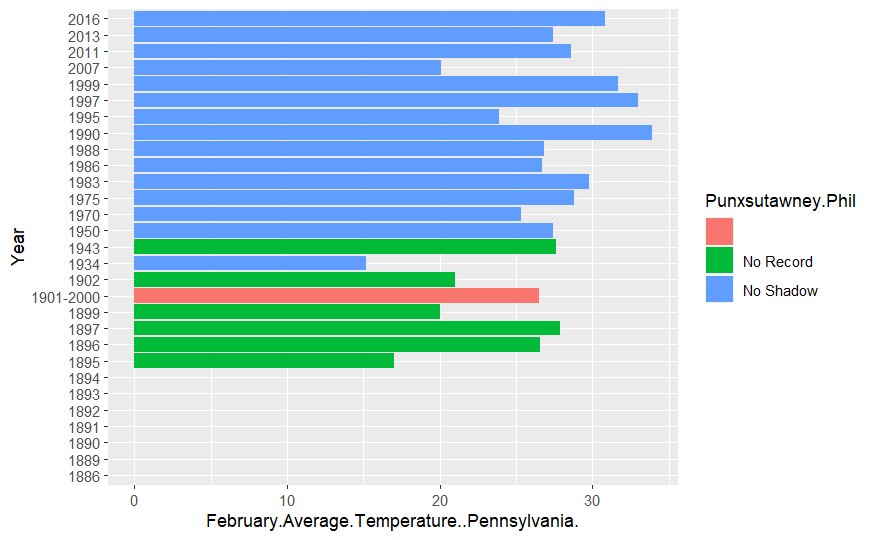
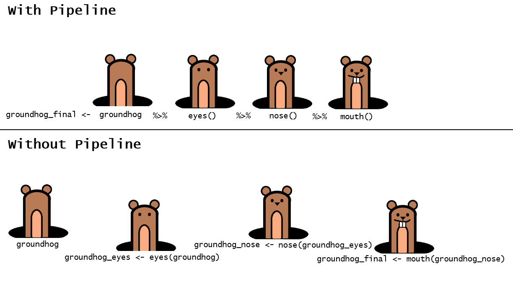
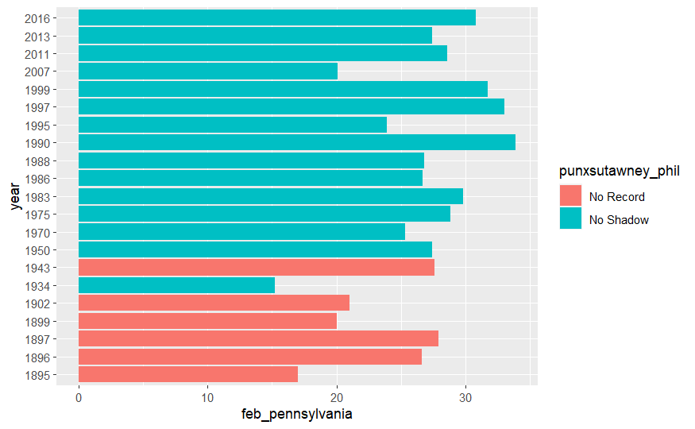

```{r setup, include=FALSE}
# Call the required libraries
library(csv)
library(janitor)
library(knitr)
library(tidyverse)

# This is auto-populated in RMD creation and used for formatting purposes.
opts_chunk$set(echo = TRUE)
```
# R Data wrangling {.tabset}

This r teaching session will introduce data wrangling tasks which commonly occur in National Park Service activities.

We will cover:

0. Awards and Accolades!
1. Review of GitHub - retrieving this document from space!
2. Importing a CSV as a data frame
3. Viewing the file
4. The Question!
5. Data clean up
  - a. Tidy column names
  - b. Clean up missing data
  - c. Filter data
  - d. Convert column data type
  - e. Change column layout
  

## 0. Awards and Accolades!
  {width=250px, align=center} </br>
  Congratulations to Rachel, Kara, Carolyn, Rebecca, Ann, Jessica, Helen, and Anna: our Golden Bison recipients. These individuals all successfully competed the second SWNC training on Github.
  
## 1. GitHub Review
1. Send Laura your GitHub username so that she can give you editing access to the repo.

    *Note for recording listeners*: You can still complete this training without repo editing access. If you prefer, complete only GitHub Review steps 4 and 5 to download a local, editable copy of the training to your machine. The only difference is that you will not be able to push your completed training back onto GitHub.

2. Go to the location of the repository at [https://github.com/palacila/SWNC_3_Data_Wrangling](https://github.com/palacila/SWNC_3_Data_Wrangling). 

3. Click on the **main dropdown** in the upper left, and begin typing your name separated by underscores. Once complete, click on **'Create branch:*your name* from main'**. This will create your branch! 

  {width=350px, align=center} </br>

4. Clone the Repo
Click on **code** in the upper right, and copy the HTTPS url provided. 

  {width=250px, align=center} </br>

5. Open R Studio. Go to **File>NewProject>VersionControl>Git** . Paste the repository URL. Information and download location should auto-populate. Click **Create Project**.

6. Switch to your branch in R studio. 

    Navigate to the Git Panel (upper right) in RStudio. If it is not there, you can go to **View >ShowGit** to view it.
Click the drop down menu in the upper right and select your branch name to switch to your branch!  

  {width=500px} </br>

7. Open the RMD file titled **Data_Wrangling_Learner.RMD** by using the file tab in the lower right corner of R studio.

    We will be filling in the blanks of this document, then pushing the completed RMD files back onto GitHub. Please note that **Data_Wrangling_Main.RMD** is a completed copy of this lesson plan which can be used as reference. 
    
    Please fill in the author section of the header now.

______________________________________________________________________________
## 2. Importing a CSV as a data frame

**To do** If you do not have csv installed, use **install.packages("csv")** in the console to install. 

**To do** Load the library by using library()
```{r}
# Do not fear the notifications. This is expected.
library(csv)
```
    
Import the file

What file types can be imported? Most file types will have their own library to make it easy to bring the data into R studio. Unsure what to use? Google "r read in file-type" to find the appropriate library.


We will be using a CSV file for this training, found here: [Groundhog data](https://www.kaggle.com/datasets/groundhogclub/groundhog-day). The file has already been placed into the data folder of this repo.


**To do** Use the read.csv() function to read in the csv from the data folder. Use <- to assign it to the variable name groundhog_raw
```{r}
# Import the dataset
groundhog_raw <- read.csv("data/Groundhog_Data.csv")
```
______________________________________________________________________________
## 3. View the file

There are multiple means of viewing our file. 

**To do** The data you just imported will appear in the environment (top right corner). Click the blue arrow to the left of the title to view a preview of the data. Here, we can see some basic information about our dataset (column titles, column data type, etc)

**To do**  From the environment single click the title. A new tab will open will a full data preview. Use the arrows next to the column headers to sort and view the data in different ways. Close the tab.

There are also functions which can be used to quickly assess our imported data.

Head() with all default settings will show the first five rows of data.

**To do** Run the code chunk below by clicking on the green arrow.
```{r}
# 5 first rows of groundhog_raw
head(groundhog_raw)
```

You can add more arguments to this function to alter the outputs.The inclusion of an integer will change the number of rows shown.

**To do** Run the code chunk below by clicking on the green arrow.
```{r}
# 4 first rows of groundhog_raw
head(groundhog_raw, 4)
```


Similarly, tail() can be used to see the end of the imported data set.

**To do** Use the tail() function to view the last 3 rows of groundhog_raw.
```{r}
# View the last three rows of groundhog_raw
tail(groundhog_raw,3)
```


We can also look at summary statistics to gain more understanding of the data set we've imported. Numeric data will show calculated statistics and missing data. Other data types will be noted with only their type.

**To do** Use the summary() function on groundhog_raw.
```{r}
# View the summary statistics of groundhog_raw
summary(groundhog_raw)
```


The last task we'll do is count the number of rows and columns in our current data frame. As an object, the output of these functions is helpful when running calculations and analyses.

*To do* Run nrow() and ncol().
```{r}
# The output should match the data frame details in your environment (132 obs.)
nrow(groundhog_raw)

# The output should match the data frame details in  your environment(10 variables)
ncol(groundhog_raw)
```
______________________________________________________________________________
## 4.The Question!

**How many times did Punxsutawney Phil predict an early spring (no shadow) correctly (February average temperature above freezing) in Pennsylvania from 1900-2000? **

Below is a visualization of the data we are interested in. Stay tuned for further training if you want to learn how to make pretty graphs! 

Notice that there are still some problems in the raw data (such as missing records) which should be addressed. 

{width=500px, align=center} </br>


To answer, we'll break the question down into steps.
**How many times did Punxsutawney Phil predict an early spring correctly in Pennsylvania from 1900-2000?**

What we need to do: 

a. Tidy the column names

b. Clean up missing data

c. Filter data: 
*Did Punxsutawney Phil predict an early spring*  filter: Punxsutawney Phil = No Shadow

*correctly in Pennsylvania* filter: February-Average-Temperature-Pennsylvania>32

d. *from 1900-2000* Convert to date and filter: year>1900 and year<2000

e. Change column layout
______________________________________________________________________________

## 5. Data Wrangling

### a. Tidy column names
We sometimes import column names which are difficult to work with or do not adequately reference the data. Lets look at our imported dataset.

**To Do** Print out the current column names of groundhog_raw using the colnames() function.
```{r}
colnames(groundhog_raw)
```


Column names can be changed in numerous ways. This course will use the tidyverse library package.

**To do** If you do not have tidyverse installed, use **install.packages("tidyverse")** in the console to install. 

**To do** Load the library by using library()
```{r}
# Do not fear the notifications, there will be many. This is expected.
library(tidyverse)
```

When using tidyverse, it is important to understand the pipeline (%>%). A pipeline denote a continuous chain of functions (output becomes the input of the following function).

While not necessary, the pipeline is strongly recommended as a tool to streamline your code. It allows us to easily visualize the processes that are occurring without needing to create a new object each time.

Below is an example which includes the same task both with and without a pipeline.

{align=center} </br>
In a code block structure these two processes would look like:
*With Pipeline*
groundhog_final <- groundhog %>%
 eyes() %>%
 nose() %>%
 mouth()

*Without Pipeline*
groundhog_eyes <- eyes(groundhog)
groundhog_nose <- nose(groundhog_eyes)
groundhog_final <- mouth(groundhog_nose)


Lets start working on our data.

**To do** Use *groundhog_edited <-* so the output is saved as a new object. Pipeline from groundhog_raw. Use the rename function to rename "February.Average.Temperature..Midwest." to Feb_Mid. 
*hint* Remember the help function of R studio will list required inputs and the format they should be in.
```{r}
# New Variable <- Old Variable pipeline
groundhog_edited <- groundhog_raw %>%
  #rename(new name = old name)
  rename(Feb_Mid = February.Average.Temperature..Midwest.,) 
```

Below is an example of renaming using index location (column number) rather than column name. While this can be speedy and efficient, it will break if you alter the column order. It is not often advised for continuous processing tasks.
```{r}
# New Variable <- Old Variable pipleline
groundhog_edited <- groundhog_edited %>%
  # rename function using column index
  rename(Feb_Average = 3,
    Mar_Average = 7)
```

There are also many options for batch renaming, which can use pattern-matching to rename columns. While this can be more complicated, it can be a great time-saver when working with multiple imported files. 

This is an example of a batch rename based on pattern matching. While it looks complicated, it can simply be copy/pasted into your own code, just change the inputs to what you need!
```{r}
# Dataframe pipeline
groundhog_edited <- groundhog_edited %>%
  # Call rename_with. Use the function (copied from online) to substitute Feb_ for the longer string.
  rename_with(function(x){gsub("February.Average.Temperature..","Feb_",x)})
```

**To do** Copy/paste the above code, alter the text to complete the same process for March.
```{r}
# March renaming function
groundhog_edited <- groundhog_edited %>%
  rename_with(function(x){gsub("March.Average.Temperature..","Mar_",x)})
```


The janitor library can also help with built-in data cleanup processes. It is commonly used in conjunction with the tidyverse library, but must be loaded separately.
**To do** If you do not have janitor installed, use **install.packages("janitor")** in the console to install. 

**To do** Load the library by using library()
```{r}
# Do not fear the install notifications, there will be many. This is expected.
library(janitor)
```


clean_names() from the janitor library will transform any any characters that are not lower-case letters, underscores, or numbers. 
**To do** Begin with *groundhog_edited <-* to replace our current working data set. Create a pipeline which calls the function clean_names() on groundhog_renamed.
```{r}
# Janitor does the work for us.
groundhog_edited <- groundhog_edited %>%
  clean_names()
```
______________________________________________________________________________


**The forecast indicates it might be time for a break.**


______________________________________________________________________________
### b. Clean up missing data.

There are many different functions and libraries that can be used for data cleanup. Again, this training will focus on tidyverse. 


The first thing we will do is remove the rows which contain NAs. Luckily, there's a function for this. 

**To do** From groundhog_edited, pipeline to the tidyverse function drop_na().
```{r}
# Notice that the output has 9 fewer rows (123 obs.)
groundhog_edited %>%
  drop_na()
```

**To do** View groundhog_edited and sort by the column Punxsutawney.Phil.  Notice there is an empty string for year 1901-2000. This was not dropped in the previous code block due to the character (not numeric) data type. 

na_if() is a function which will replace a specified character string with a null value. We need to replace no value ("")with a null value ("NA") so that R recognizes them both as the same thing.

**To do** Begin with *groundhog_edited <-* to replace our current working data set. Using a tidyverse pipeline from groundhog_raw, replace the null character values with na_if(""). Then, pipeline drop_na() to remove ALL missing data.
```{r}
# new_dataframe <- raw_dataframe pipeline
groundhog_edited <- groundhog_edited %>%
  # replace empty with NA pipeline
  na_if("") %>%
  # remove all NAs from dataframe
  drop_na()

# groundhog_edited should now contain 122 rows.
```

But there are still missing records in our data!
{width=500px, align=center} </br>

For the purposes of answering our question we also want to remove this data.
**To do** Begin with *groundhog_filtered <-* to create a new working data set. Pipeline from groundhog edited and use the filter() function with punxsutawney_phil != "No Record" to remove the missing records.
```{r}
# new_dataframe <- raw_dataframe pipeline
groundhog_filtered <- groundhog_edited %>%
  # != means does not equal
  filter(punxsutawney_phil != "No Record")

#There should be 116 observations in this new data frame.
```


Note:We have only covered missing row removal in this course. When dealing with large-scale numeric data, there are a number of other options which may be employed.
______________________________________________________________________________
### c. Filter data


We'll first filter for Phil predicting an early spring (no shadow). Lets take a look at what is left.


**To do** Take a look at the current unique values by running the code chunk below.
```{r}
# Focus on Punxsutawney Phil outcome
groundhog_filtered$punxsutawney_phil %>%
  # find unique values
  unique()

```

Like before, we want to use the filter function to pull out only the "No Shadow" data to indicate records where Punxsutawney Phil predicted an early spring.

**To do** Begin with *groundhog_filtered <-* to replace our current working data set. Using a tidyverse pipeline from groundhog_filtered, use the filter function with punxsutawney_phil = No Shadow"
```{r}
# Data pipeline
groundhog_filtered <- groundhog_filtered %>%
  # Filter out the data we don't want using !=. Quotation marks indicate a character string.
  filter(punxsutawney_phil != "No Shadow")

# There should now be 101 observations in the dataframe
```


Now we'll filter for February Pennsylvania temperature above freezing

Filtering can also be performed on a numeric column. Lets filter our data set to include only temperatures above 32 degrees.


**To do** Begin with *groundhog_filtered <-* to replace our current working data set. Using a tidyverse pipeline from groundhog_filtered, use the filter function with feb_pennsylvania >32
```{r}
# Data pipeline
groundhog_filtered <- groundhog_filtered %>%
  # Use the > symbol for the logical test.
  filter(feb_pennsylvania >32)

# There should now be 12 observations in the dataframe
```
____________________________________________________________________________
### d. Convert and filter year range

Sometimes data is imported with the wrong data type and must be converted.
**To do** In your environment (top right side) click the blue arrow next to groundhog_filtered to show the column information.

Remember when we originally imported the information. Notice on the Y axis, there is a record for "1901 - 2000"
{width=500px, align=center} </br>
This means that not all values were numeric upon import; R automatically assigned this column to a character datatype. Now that we the odd record was removed during our data clean-up, we can convert the column to a date format. 


**To do** Run the below code to transform the year column from a character to a date column. Verify the change by clicking the blue arrow in the environment to view the columns of groundhog_filtered. 
```{r}
# Data pipeline
groundhog_filtered <- groundhog_filtered %>%
  transform(year = ISOdate(year, 1, 1))

```

Now that our column is numeric, we can use a numeric test to filter out data.
**To do** Begin with *groundhog_filtered <-* to replace our current working data set. Using a tidyverse pipeline from groundhog_filtered, use the filter function with year >= "1900-01-01" and year < "2001-01-01"
```{r}
# Data pipeline
groundhog_filtered <- groundhog_filtered %>%
  # Use & to indicate both statements must be TRUE
  filter(year >= "1900-01-01" & year < "2001-01-01")

# There should now be 10 observations in the data frame
```
____________________________________________________________________________

### e. Change column layout
Often times, we want to manipulate our tables so that the columns are in a logical order. There are many ways to accomplish this task. 

**To do** Begin with *groundhog_layout <-* to create a new working data set. Using a tidyverse pipeline from groundhog_filtered, use select() to choose only the columns for answering our question (year, punxutawney_phil, and feb_pennsylvania)
```{r}
groundhog_layout <- groundhog_filtered %>%
  # Use & to indicate both statements must be TRUE
  select(year, punxsutawney_phil, feb_pennsylvania)

# There should now be 10 observations of only 3 variables(columns)
```

We can also move the column order
**To do** Begin with *groundhog_layout <-* to replace our current working data set. Using a tidyverse pipeline from groundhog_layout, use relocate to pull the column punxsutawney_phil to the front, followed by feb_pennsylvania
```{r}
# Create a new dataframe using a pipeline from groundhog_renamed
groundhog_layout <- groundhog_layout %>% 
  # columns will move to the front in the order written
  relocate(punxsutawney_phil,feb_pennsylvania)
```

The relocate function can also be used to indicate that we want a column to come before or after another column in our data set.
**To do** Run the below code chunk to move punxsutawney_phil after year.
```{r}
# Create a new dataframe using a pipeline from groundhog_renamed
groundhog_layout <- groundhog_layout %>% 
  # columns will move to the front in the order written
  relocate(punxsutawney_phil, .after =year)
```


## 6.The Answer!
We have reached the end of this data wrangling course!

While we completed these steps all separately, they could be completed in one go. Below is a summary of what we accomplished.
```{r}
groundhog_final <- groundhog_raw %>%
  
  # Rename a single column
  rename(Feb_Mid = February.Average.Temperature..Midwest.,) %>%
  # Rename a column by index
  rename(Feb_Average = 3, Mar_Average = 7) %>%
  # Batch rename using find and replace (gsub)
  rename_with(function(x){gsub("February.Average.Temperature..","Feb_",x)}) %>%
  rename_with(function(x){gsub("March.Average.Temperature..","Mar_",x)}) %>%
  # Janitor to clean names
  clean_names() %>%
  # Convert missing character string to NA
  na_if("") %>%
  # remove all NAs from dataframe
  drop_na() %>%
  # Filter the data using a logical test on a character
  filter(punxsutawney_phil != "No Shadow") %>%
  # Filter the data using a logical test on a number
  filter(feb_pennsylvania >32) %>%
  # Transform a column to a different data type and perform a logical test
  transform(year = ISOdate(year, 1, 1)) %>%
  filter(year >= "1900-01-01" & year < "2001-01-01") %>%
  # Select only the data we want 
  select(year, punxsutawney_phil, feb_pennsylvania) %>%
  # Move our columns around
  relocate(punxsutawney_phil,feb_pennsylvania) %>%
  relocate(punxsutawney_phil, .after =year)
  
```

We can get our answer by simply running the nrows() function to determine the amount of records which contain all our criteria. 
**To do** Run nrow() on groundhog layout and groundhog_final. Did we get to the correct answer?
```{r}
#groundhog_layout
nrow(groundhog_layout)
#groundhog_final
nrow(groundhog_final)


# hint - you should have 10 for both
```


As a sneak peak for the upcoming training sessions, here is a visualization of the data frame we pulled from our original data! 
**To do** run the following code chunk to see the graph!
```{r}
# Raw Data pipeline
groundhog_final %>%
  # Make a plot of the data. 
  ggplot(aes(x = year, y = feb_pennsylvania, fill = punxsutawney_phil)) + 
  geom_col()
```


