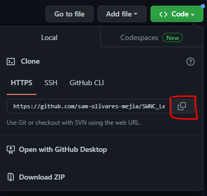
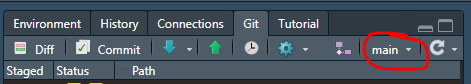

```{r setup, include=FALSE}
# Call the required libraries
library(csv)
library(janitor)
library(knitr)
library(tidyverse)

# This is auto-populated in RMD creation and used for formatting purposes.
opts_chunk$set(echo = TRUE)
```

This r teaching session will introduce data wrangling tasks which commonly occur in National Park Service activities.

We will cover:

0. Awards and Accolades!
1. Review of GitHub - retrieving this document from space!
2. Importing a CSV as a data frame
3. Viewing the file
4. Data clean up
  - Remove rows with missing data
  - Filter data
  - Change column names
  - Change column layout
  - Convert column data type
  

## 0. Awards and Accolades!
  {width=200px} </br>
  Congratulations to Rachel, Kara, Carolyn, Rebecca, Ann, Jessica, Helen, and Anna: our first Golden Bison recipients.
    
  These individuals all successfully competed the second SWNC training on Github.
  
## 1. GitHub Review
1. Send Laura your GitHub username so that she can give you editing access to the repo.

    *Note for recording listeners*: You will not have editing access to the repository, you can still create a clone and follow along with a local copy (rather than a branch). Please skip steps 2.2 and 2.5.

### Create a Branch

1. Create a branch: Go to the location of the [SWNC Data Wrangling Repository on GitHub](https://github.com/palacila/SWNC_3_Data_Wrangling). 

2. Click on the **main dropdown** in the upper left, and begin typing your name separated by underscores. Once complete, click on **'Create branch:*your name* from main'**. This will create your branch! 

```{r createbranch, echo=FALSE, out.width="50%",fig.align="center"}
include_graphics("images/CreateBranch.png")
```

3. Clone the Repo
Click on **code** in the upper right, and copy the HTTPS url provided. 

```{r CloneRepo, echo=FALSE, out.width="30%",fig.align="center"}

```

4. Open R Studio. Go to **File>NewProject>VersionControl>Git** . Paste the repository URL. Information and download location should auto-populate. Click **Create Project**.

5. Switch to your branch in R studio. 

    Navigate to the Git Panel (upper right) in RStudio. If it is not there, you can go to **View >ShowGit** to view it.
Click the drop down menu in the upper right and select your branch name to switch to your branch!  

```{r SwitchBranches, echo=FALSE, out.width="50%", fig.align="center"}

```

6. Open the RMD file titled **Data_Wrangling_Learner.RMD** by using the file tab in the lower right corner of R studio.

    We will be filling in the blanks of this document, then pushing the completed RMD files back onto GitHub. Please note that **Data_Wrangling_Main.RMD** is a completed copy of this lesson plan which can be used as reference. 
    
    Please fill in the author section of the header now.


## 2. Importing a CSV as a data frame

**To do** If you do not have tidyverse installed, use **install.packages("csv")** in the console to install. 

**To do** Load the library by using library()
```{r}
# Do not fear the install notifications. This is expected.
library(csv)
```
    
Import the file

What file types can be imported? Most file types will have their own library to make it easy to bring the data into R studio. Unsure what to use? Google "r read in <file type> file" to find the appropriate library.


Today we will be using a CSV file, as this is the most common export from our databases.This file was modified from a public dataset located here [Groundhog data](https://www.kaggle.com/datasets/groundhogclub/groundhog-day)

**To do** Use the read.csv() function to read in the csv from the data/ folder. Use <- to assign it to the variable name groundhog_raw
```{r}
# Import the dataset
groundhog_raw <- read.csv("data/Groundhog_Data.csv")
```

### The Question!

How often did Punxsutawney Phil correctly predict that Pennsylvania would have an early spring (an average temperature above freezing) in February? 

Here is a visualization of the data we'll be working with. Stay tuned for further training if you want to learn how to make pretty graphs!
```{r}
# Raw Data pipeline
groundhog_raw %>%
  # Filter out full and partial shadow predictions (not part of the question)
  filter(Punxsutawney.Phil != "Full Shadow", Punxsutawney.Phil != "Partial Shadow") %>%
  # Make a plot of the data. 
  ggplot(aes(y = Year, x = February.Average.Temperature..Pennsylvania., fill = Punxsutawney.Phil)) + 
  geom_col()
```


## 3. View the file

**To do** The data you just imported will appear in the environment (top right corner). Single click to open a new tab and view the data table. Use the arrows next to the column headers to sort and view the data in different ways.


There are also quick functions which can be used to quickly assess our imported data without viewing the whole file. This is particularly helpful for large data sets with thousands of rows.

```{r}
# head can be used to show the first few rows. By clicking the green arrow in the corner of the code block, the output will print below.
head(groundhog_raw)
```
```{r}
# You can add more arguments to the function. The inclusion of the integer "10" will show the first 10 rows instead of the default 5. 

head(groundhog_raw, 10)
```

**To do** Following the same format as above, use the tail() function to view the last 7 rows of groundhog_raw.

```{r}
# tail pulls the last rows of the data
tail(groundhog_raw,7)
```

We can also look at summary statistics to gain more understanding of the dataset we've imported. 

**To do** Use the summary() function on groundhog_raw.
```{r}
# We will use all default arguments, only the dataset name needs to be supplied.
summary(groundhog_raw)
```

Notice that there is not only min and max values, but also NA values.

The last task we'll do is count the number of rows in our current dataframe.

*To do* Run nrow() and ncol() using all defaults. We will only need to supply the dataframe name.
```{r}
# The output should match the dataframe details in your environment (132 obs.)
nrow(groundhog_raw)

# The output hsould match the dataframe details in  your environment(10 variables)
ncol(groundhog_raw)
```


## 4. Data Clean-up

### Remove rows with missing data.

Now we will clean up this data. There are many different functions and libraries that can be used. This training will focus on tidyverse. This is a set of libraries which are commonly used and all work in conjunction with one another.

**To do** If you do not have tidyverse installed, use **install.packages("tidyverse")** in the console to install. 

**To do** Load the library by using library()
```{r}
# Do not fear the install notifications, there will be many. This is expected.
library(tidyverse)
```

The first thing we will do is remove the rows which contain NAs. 

**To do** Use tidyverse functions to remove NAs We will practice using a pipeline (%>%), which will allows you to "stack" functions.
```{r}
# Notice that the output has 9 fewer rows (123 obs.)
groundhog_raw %>%
  drop_na()
```

**To do** View the new dataframe and sort by the column Punxsutawney.Phil.  Notice there is an empty string for year 1901-2000. This was not dropped in the previous code block due to the character data type. 


**To do** Using tidyverse, replace the null character values with na_if(). Then, use drop_na() to remove ALL missing data. Save the output as a new dataframe, groundhog_clean.
```{r}
# new_dataframe <- raw_dataframe %>% replace Null with NA %>% remove all NAs
# Output should contain 122 rows.
groundhog_clean <- groundhog_raw %>%
  na_if("") %>%
  drop_na()
  
```

Note: We have only covered missing row removal in this course. When dealing with large-scale numeric data, there is a number of other options (such as replacing nulls with the median value or with the average of neighboring values) which may be employed.

### Filter data
There are also instances where Punxsutawney Phil has "No Record". For the purposes of answering our question we also want to remove this data.

```{r}
# Data pipeline
groundhog_clean <- groundhog_clean %>%
  # Filter out the data we don't want using !=
  filter(Punxsutawney.Phil != "No Record")
```


### Change column names

We sometimes import column names which are difficult to work with or do not adequately reference the data. Column names can be changed in numerous ways. This course will use the Rename() function of tidyverse.

**To Do** Print out the current column names of groundhog_clean using the colnames() function using all defaults. We will only need to supply the dataframe name.
```{r}
colnames(groundhog_clean)
```

**To do** Rename "February.Average.Temperature..Midwest."  to Feb_Mid. Create a new dataframe called groundhog_renamed
```{r}
# New Variable <- Old Variable pipleline
groundhog_renamed <- groundhog_clean %>%
  #rename(new name = old name)
  rename(Feb_Mid = February.Average.Temperature..Midwest.,) 
```

There are also many options for batch renaming, which can use pattern-matching to rename columns. While this can be more complicated, it can be a great time-saver when working with multiple imported files. 

This is an example of renaming using index location (column number). While this can be speedy and efficient, it will break if you alter the column order. It is not often advised for continuous processing tasks.
```{r}
# New Variable <- Old Variable pipleline
groundhog_renamed <- groundhog_renamed %>%
  # rename function using column index
  rename(Feb_Average = 3,
    Mar_Average = 7)
```


This is an example of a batch rename based on pattern matching. While it looks complicated, it can simply be copy/pasted into your own code, just change the inputs to what you need!
```{r}
# Dataframe pipeline
groundhog_renamed <- groundhog_renamed %>%
  # Call rename_with. Use the function (copied from online) substitutes Feb_ for the longer string.
  rename_with(function(x){gsub("February.Average.Temperature..","Feb_",x)})
```


**To do** Copy/paste the above code, alter the text to complete the same process for March.
```{r}
# March renaming function
groundhog_renamed <- groundhog_renamed %>%
  rename_with(function(x){gsub("March.Average.Temperature..","Mar_",x)})
```


The janitor library can also help with built-in column name cleanup processes. It will remove any any characters that are not lower-case letters, underscores, or numbers. It is commonly used in conjuntion with the tidyverse library, but must be loaded separately.

In our dataset, the janitor library will get rid of the periods and standardize our capitalization.We will use it now.

**To do** If you do not have tidyverse installed, use **install.packages("janitor")** in the console to install. 

**To do** Load the library by using library()
```{r}
# Do not fear the install notifications, there will be many. This is expected.
library(janitor)
```

**To do** Begin with *groundhog_renamed <-* to replace our current working dataset. Create a pipeline which calls the function clean_names() on groundhog_renamed.


Call the clean names function.
```{r}
# Janitor does the work for us.
groundhog_renamed <- groundhog_renamed %>%
  clean_names()
```

### Change column layout

Often times, we want to manipulate our tables so that the columns are in a logical order. There are many ways to accomplish this task. 

An easy way to move specific columns is to use the tidyverse relocate function. We can list the column names that we want, and they will be placed in order at the front of the data frame.
```{r}
# Create a new dataframe using a pipeline from groundhog_renamed
groundhog_layout <- groundhog_renamed %>% 
  # Relocate the average columns to the front
  relocate(mar_average,feb_average)
```

**To Do**
```{r}

```

### Convert column to appropriate type
make this numeric LAURA

```{r}
# Raw Data pipeline
groundhog_layout %>%
  # Filter out full and partial shadow predictions (not part of the question)
  filter(punxsutawney_phil != "Full Shadow", punxsutawney_phil != "Partial Shadow") %>%
  # Make a plot of the data. 
  ggplot(aes(y = year, x = feb_pennsylvania, fill = punxsutawney_phil)) + 
  geom_col()
```
Lets just see if the temperature is above 32. 

**To do** The full code block has been copy/pasted from above. Add a filter which grabs only feb_average values above 32 degrees. Remember to add a pipeline.

```{r}
# Raw Data pipeline
groundhog_layout %>%
  # Filter out full and partial shadow predictions (not part of the question)
  filter(punxsutawney_phil != "Full Shadow", punxsutawney_phil != "Partial Shadow") %>%
  # Additional Filter - don't forget the %>%
  filter(feb_pennsylvania >32) %>%
  # Make a plot of the data. 
  ggplot(aes(y = year, x = feb_pennsylvania, fill = punxsutawney_phil)) + 
  geom_col()
```


