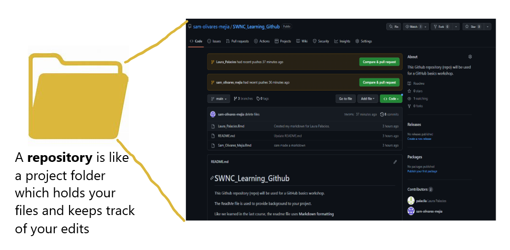

```{r setup, include=FALSE}
knitr::opts_chunk$set(echo = TRUE)
library(knitr)
```


### 1. Install Git
  Git is the software needed for this learning session.If you do not already have Git installed on your computer, please install before the session.  
  
  a. Open the **Software Center** application on your computer (this will allow you to download without admin approval)
  b. Navigate to the **Applications** tab 
  c. Click on **Git** 
  d. Click Install 
    
{width=500px}

### 2. Set Up a Github Account 

Go to [https://github.com/join](https://github.com/join) to get started!

Username example: LpalaciosNPS or sam-olivares-mejia

You will need to verify your email to complete the joining process.

Once verified you will see the screen below. You don't need to personalize your account right away, click skip to reach your home screen.

{width=500px}

Your new home page will look like this

{width=500px}
</br></br></br>


**To Do: Once you've completed this step ** </br>
**Please email your username to Sam (laura_palacios@nps.gov)** so she can add you to this week's training github repository! 

### 3. Open R Studio and install the `usethis` package 
  Remember, to install packages we use the install.packages() function. You can type this in the Console.
  
{width=600px, height=400px}


### 4. Navigate to **Tools > Global Options** 
  a. On the list on the left, click on GIT SVN
  b. Make sure the 'Enable version interface for RStudio project box is checked 
  c. Your screen should look like this (git.exe path may differ)

{width=300px}

  d. Click Apply then OK 

## Github Overview 

### Some terminology




## References and Troubleshooting
Git Install: If you're having issues installing Git, consult the [R Advisory Group Resources Sharepoint site](https://doimspp.sharepoint.com/sites/nps-nrss-imdiv/SitePages/R-Adv.aspx) and submit a helpdesk ticket if needed.

GitHub Account Setup: This [Wiki How](https://www.wikihow.com/Create-an-Account-on-GitHub) gives in depth instructions. 

This section is adapted from Kate Miller and Sarah Wright's IMD Training on [Version Control](https://katemmiller.github.io/IMD_R_Training_Advanced/) 